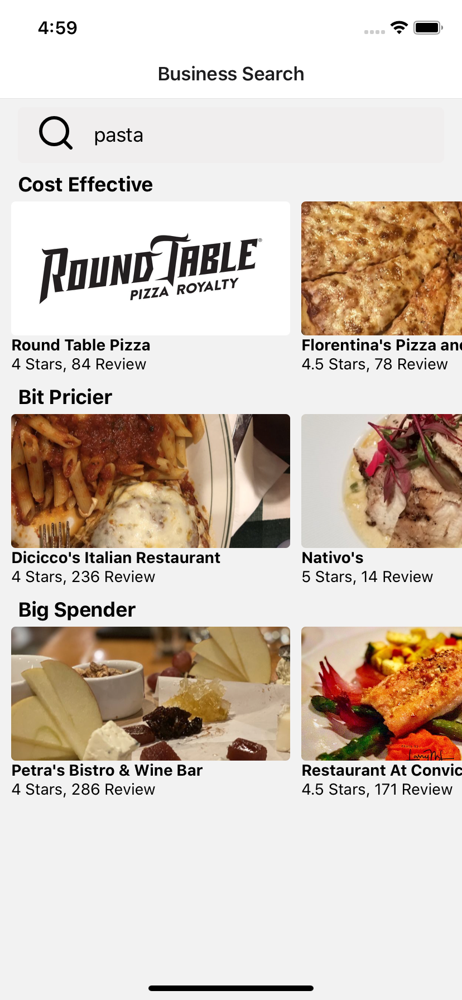

# Yelp Search
Yelp Search it´s an app that i made for practice that uses Yelp´s API to get restaurant data. I´ve used axios to make the requests and make hooks to separate business logic and have a more organized code. 

     

    

